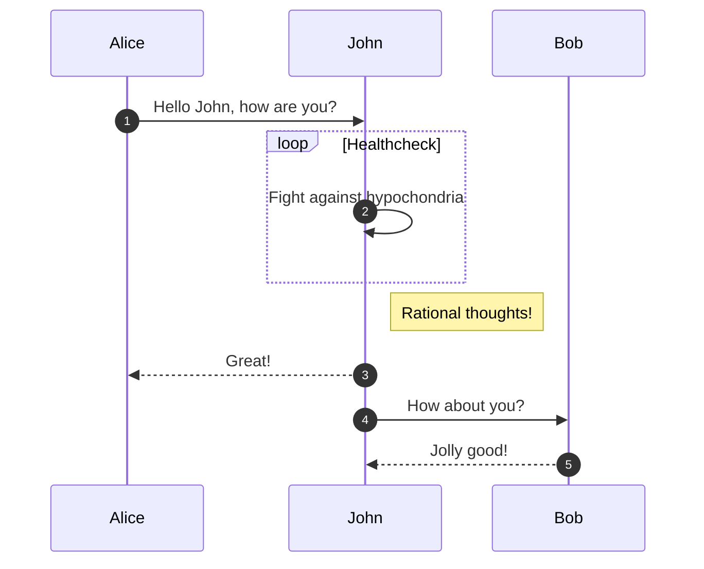

# Using Mermaid Diagrams

[Mermaid] diagrams^[Also, footnotes are a thing. :)] rendered client-side in your static blog.

And here's another, to prove enumeration is a thing.

These are taken from the GitHub announcement: <https://github.com/github/roadmap/issues/372>

Don't forget there's a [draft you can view](/drafts/untitled) in this demo.

[Mermaid]: https://github.com/mermaid-js/mermaid
